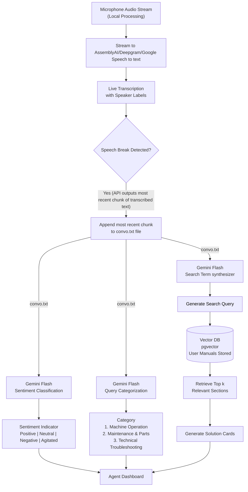
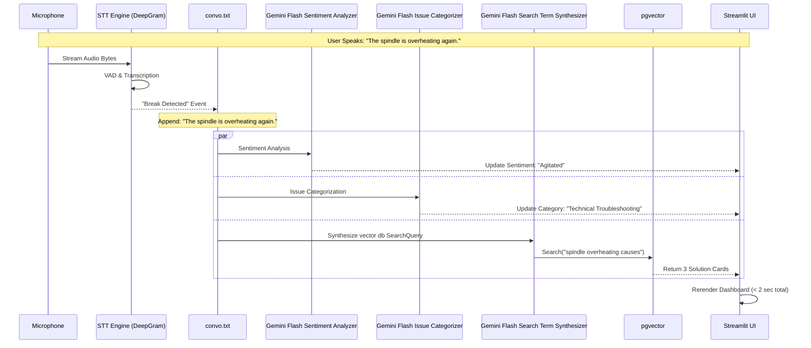

# Project Alpha: Real-Time Support Intelligence (POC)

## 1. Executive Summary

**Project Alpha**  is a Proof of Concept (POC) designed to support Biesse Group support agents during live calls. Operating strictly on `localhost`, it captures microphone input, transcribes speech in real-time, and provides instant, context-aware technical solutions from Biesse user manuals

**Core Mission:** To validate the "Listen → Analyze → Show Insights → Match Documentation" technical pipeline in a controlled environment, using a low-latency, file-based architecture (`convo.txt`), proving that real-time transcription, issue categorization, and RAG (Retrieval-Augmented Generation) can operate with sub-second latency before scaling to full telephony integration.

**Architecture Shift:** Unlike traditional RAG systems, this POC uses an **Event-Driven Pipeline** where speech breaks trigger parallel processing agents (Sentiment, Categorization, Search) to ensure recommendations appear on the dashboard within **<2 seconds**.

**Scope:** Single-channel local audio capture using `PyAudio`, simulating a live support scenario to trigger downstream intelligence.

---

## 2. POC System Architecture

### 2.1 Architectural Patterns

**Primary Pattern:** **Event-Driven Pipeline** with **Latent Text Accumulation**.

**Secondary Patterns:**
- **Stream-to-File Persistence:** Utilizes a flat-file (`convo.txt`) as a high-speed, lock-free short-term memory buffer.
- **Parallel Agent Execution:** Triggers three distinct LLM agents (Sentiment, Triage, Search) simultaneously upon detecting a "Speech Break" to minimize latency.
- **Human-in-the-Loop (HITL):** The system provides "Solution Cards" and "Sentiment Indicators" but relies on the agent to verbalize the solution.

**Key Mechanics:**
* **Local Processing:** Audio is captured and processed locally using `PyAudio` (no call recording stored).
* **Stream-to-File:** Transcribed chunks are appended to a local `convo.txt` file. This acts as a lightweight, real-time "Short Term Memory" for the system.
* **Trigger Logic:** The system relies on **Speech Break Detection** (via AssemblyAI/Deepgram) to commit text and trigger the AI agents.

### 2.2 High-Level Architecture Diagram


## 2.3 Detailed Component Architecture

### A. Application Structure (Python + Streamlit)

```text
project-alpha/
├── app/
│   ├── main.py                  # Streamlit Entry Point
│   ├── orchestrator.py          # Asyncio loop manager
│   ├── config.py                # Environment & API Keys
│   ├── core/
│   │   ├── audio/
│   │   │   ├── capture.py       # PyAudio stream handler
│   │   │   └── stt_client.py    # AssemblyAI/Deepgram WebSocket
│   │   ├── agents/
│   │   │   ├── sentiment_analyzer.py     # Gemini Flash Sentiment Prompt
│   │   │   ├── issue_classifier.py        # Gemini Flash Categorization
│   │   │   └── search_term_synth.py        # Gemini Flash Query Synth
│   │   └── rag/
│   │       ├── vector_store.py  # pgvector connection (psycopg3)
│   │       ├── embeddings.py    # Google/OpenAI Embedding wrapper
│   │       └── ingestion.py     # PDF chunking logic
│   ├── data/
│   │   ├── manuals/             # Raw PDF storage
│   │   └── buffer/
│   │       └── convo.txt        # Live conversation buffer
│   └── ui/
│       ├── layout.py            # Streamlit columns/containers
│       └── components.py        # Solution Card rendering
├── scripts/
│   ├── seed_db.py               # Vector DB seeding script
│   └── test_mic.py              # Microphone diagnostic tool
├── docker-compose.yml           # Database orchestration
└── requirements.txt             # Dependency definitions
```

**Technology Stack - Application:**

* **Frontend:** Streamlit 1.30+ (for rapid dashboard prototyping).
* **Backend Logic:** Python 3.10+ (AsyncIO).
* **Audio Capture:** PyAudio 0.2.14+.
* **Transcription:** Deepgram Python SDK (Streaming).
* **Vector Logic:** pgvector (via psycopg2 or SQLAlchemy).

#### C. Data Flow Architecture


## 3. Complete Technology Stack & Decision Matrix

### 3.1 Core Application Stack

**Audio & Transcription Stack**

| Layer | Technology | Version | Justification |
| :--- | :--- | :--- | :--- |
| **Input Capture** | PyAudio | 0.2.14 | Low-level access to local hardware input (Index 0/1), distinct from system audio. Essential for capturing only the agent side audio. |
| **STT Engine** | Deepgram | 5.3.2 | Chosen specifically for "Speech Break" (End of Utterance) detection. we need "Speech Break"events to trigger the AI agents. Also was the fastes among competitors |
| **Buffer** | Local File System/RAM | `convo.txt` | Virtually no latency |

**AI/ML Stack**

| Component | Technology | Model | Justification |
| :--- | :--- | :--- | :--- |
| **Inference** | Google Gemini | `gemini-2.5-flash-lite` | **Speed is critical.** Flash-lite offers sub-second inference needed to update the UI while the user is still thinking. Lower cost per token allows continuous polling. |
| **Inference: Search Term Synth** | Google Gemini | `gemini-3-flash` | **Must balance reasoning w speed** Flash also offers sub-second inference but has thinking enabled. |
| **Embeddings** | Google Embeddings | `gemini-embedding-001` | Lightweight dimensions (1536) perfect for technical manual sections. Fast cosine similarity calculation in Postgres. |
| **Orchestrator** | Python AsyncIO | N.A | Manages the websocket stream (STT) and the REST API calls (Gemini) concurrently without blocking the UI thread. |

**Data & Storage Stack**

| Component | Technology | Version | Justification |
| :--- | :--- | :--- | :--- |
| **Vector DB** | PostgreSQL | 0.8.1 | **Simplicity.** Runs in a single Docker container. Handles both the vector embeddings of manuals and any structured logs (of previous `{issue:solution}`), we might keep. |
| **Ingestion** | pdfminer.six | 20260107 | Open Source best cost variant that has the best accuracy for PDF variants |

#### Development Tools

| Component | Technology | Version | Purpose |
|:----------|:-----------|:--------|:--------|
| **Version Control** | Git | Latest | Source code management |
| **Package Manager (Python)** | Pip | Latest | Dependency management |
| **Linting (Python)** | SonarLint | Latest | Code formatting |
| **Type Checking (Python)** | Pylance | Latest | Static type checking |
| **Type Checking (Python)** | Pydantic | Latest | Runtime type checking |
| **Testing (Python)** | pytest | Latest | Unit & integration tests |
| **Pre-commit Hooks** | detect-secrets | Latest | local via .pre-commit-config.yaml |

### 3.2 Trade-off Analysis (POC Specific)

| Decision Point | Chosen Solution | Alternative Considered | Why We Chose This |
| :--- | :--- | :--- | :--- |
| **Context Store** | Flat File (`convo.txt`) | A python dict in `JSON` | **LLM Compatibility**: Plain text without tags and symbols best for LLM latency  |
| **Frontend** | Streamlit | React / Next.js | **Velocity.** We need to display data now. Streamlit handles the websocket/UI refresh loop in 10 lines of code vs 100s in React, also simplicity in implementation. |
| **Model** | Gemini Flash/Flash-lite | GPT-4 / Claude Opus | **Latency.** Heavy models take 3-5s to reason. Flash takes <800ms. In a live call, 3 seconds of silence is awkward. |

## 4. The Intelligence Engine: The "Three-Agent" Architecture

Project Alpha replaces a single monolithic LLM call with three specialized, lightweight agents running in parallel to ensure speed.

### 4.1 Agent 1: sentiment_analyzer

Monitors the emotional temperature of the call to warn the agent.

**Prompt Logic:**
- **Input:**  `convo.txt`.
- **Task:** Classify into [Positive, Neutral, Negative, Agitated].
- **Output:** Single token.

**Dashboard Effect:** Changes UI border color (Green/Grey/Red/Flashing Red).

### 4.2 Agent 2: issue_classifier

Immediately buckets the conversation into Biesse-specific support domains.

**Buckets:**
- **Machine Operation:** (e.g., "How do I calibrate the Z-axis?")
- **Maintenance & Parts:** (e.g., "I need a new filter for the vacuum pump.")
- **Technical Troubleshooting:** (e.g., "Error code E405 on the inverter.")

**Logic:** If the category changes (e.g., from Operation to Parts), the RAG pipeline swaps the target index (e.g., searches `parts_catalog` instead of `user_manual`).
- **Input:**  `convo.txt`.
- **Task:** Classify into [Machine Operation, Maintenance & Parts, Technical Troubleshooting].
- **Output:** Single token.

### 4.3 Agent 3: search_term_synth

Synthesises search terms.

**Workflow:**
- **Synthesize:** Converts conversational mess ("Uhh, the thing that cuts, it's getting hot") into a technical query ("Spindle overheating troubleshooting").
- **Retrieve:** Queries pgvector for the top k chunks with high cosine similarity (>0.75).
- **Format:** Generates a JSON "Solution Card".

**Solution Card Structure:**

```json
{
  "title": "Spindle Cooling System Check",
  "category": "Machine Operation | Maintenance & Parts | Technical Troubleshooting",
  "confidence": 0.0,
  "steps": [
    "Step 1",
    "Step 2",
    "Step 3"
  ],
  "source": {
    "manual": "Document name",
    "section": "Section heading",
    "page": 0
  }
}
```
## 5. Biesse-Specific Domain Features

### 5.1 Manual Chunking Strategy

Standard PDF parsing fails on technical manuals due to multi-column layouts and tables. Alpha uses a semantic chunking strategy:

- **Header detection:** Chunks are broken by Section Headers (e.g., "4.1 Routine Maintenance").
- **Overlap:** 10% overlap between chunks to preserve context across page breaks.

## 6. Getting Started

### 6.1 Setup & Installation

**Prerequisites:**
- Docker Desktop (for pgvector)
- Python 3.10+
- Microphone (External USB preferred for testing)
- API Keys: Google AI Studio (Gemini), AssemblyAI/Deepgram

**Quick Start:**

**Clone & Environment:**

```bash
git clone <git_link_to_be_added>
cd project-alpha
cp .env.example .env
# Add GEMINI_API_KEY and ASSEMBLYAI_API_KEY
```
**Start Database:**

docker-compose up -d
# Starts postgres:15-alpine with pgvector extension

**Ingest Manuals:**

Place Biesse PDFs in app/data/manuals/ and run

```bash
<script to be added>
```

**Run App**

```bash

streamlit run app/main.py
```
Access dashboard at http://localhost:8501

### 6.2 Monitoring the POC
Since this is a localhost POC, monitoring is done via the terminal console.

Console Output Example:

```Text

[AUDIO] Stream active...
[STT] Break Detected. Final Transcript: "I'm getting error PLC 400."
[FILE] Appended to convo.txt
[AGENT-SENTIMENT] Neutral (110ms)
[AGENT-TRIAGE] Technical Troubleshooting (150ms)
[AGENT-SEARCH] Query: "PLC 400 error code Rover series" (200ms)
[DB] Retrieved 3 chunks (45ms)
[UI] Dashboard updated.
```

## 7. License & Support

**License:** Proprietary - Internal Mirai Labs Use Only (POC Phase).

**Support:**
- Lead Developer: that_wolxfie57
- Repository: Internal GitLab/GitHub

**Document Version:** 0.0.1
**Last Updated:** February 13, 2026
